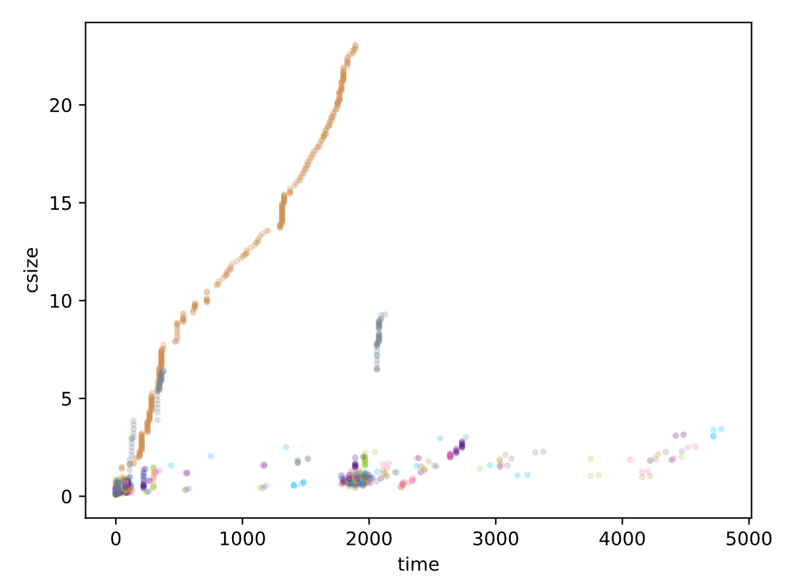

# decrypto-flowsies

The project has two parts, the analyzer and the generator. The generator generates network traffic
by loading web pages and the analyzer captures the network traffic and generates datasets. The analyzer is implemented in Python (3.8+) and
the generator in nodejs (16+), these are required in order to run. See documentation for each part
on how to install application dependencies.

The goal of the project is to build machine learning models usable on TLS encrypted websites. The model
should be able to distinguish pages within a site to break privacy and infer information about the user. As an example,
a user browses a health information site and reads about rare disease X - the model should then be able
to classify the flow and match it to the webpage describing disease X. 

It is not a primary interest to distinguish websites from eachother, because this is much easier, already leaks
in multiple ways, and doesn't break privacy to the same degree. As a result of the analysis, certain key characteristics
that makes sites easy to analyze.



### Limitations

This is the authors first project considering machine learning so information might be incorrect, the approach inefficient etc. The 
project is nevertheless published here. In order for the project to see some success, limitations are as follows,

* Analyzes a single ciphersuite per site.
* Evaluate a limited number of features.
* Use of limited/ineffective/simple learning algorithms.
* Latency/jitter is not considered, LAN analysis only.
* Flows are generated by a single client (generator).

### Ethical & Legal considerations

* Ensure that user consent has been explicitly given when capturing live data.
* Prefer to mirror websites and serve them locally on LAN for training.
* Ensure proper delay between site loads when testing against online sites.
* Limit the number of requests that is performed for online sites.

## Traffic analyzer

Implements the following features

* collects network traffic based on a given filter.
* communicates with the generator to label traffic.
* saves/loads traffic datasets in json.
* generates dataset visualisations.
* trains the machine learning model. (tbd)
* performs classification of traffic as it is analyzed. (tbd)
* notifies the generator when it's running in monitor mode. (tbd)

To install requirements run `pip install -r requirements.txt`

The analyzer uses `asyncio`, `pandas` and `scapy`.

from `./` run, 
```
$ python -m analyzer.run -h
usage: run.py [-h] [--interface INTERFACE] [--ip IP] [--ports [PORTS]] [--address [ADDRESS]] [--dump [DUMP]] [--load LOAD]

Traffic analyzer.

options:
  -h, --help            show this help message and exit
  --interface INTERFACE
                        interface to listen on.
  --ip IP               host to capture traffic from/to.
  --ports [PORTS]       ports to capture traffic on.
  --address [ADDRESS]   location of shared directory.
  --dump [DUMP]         dump all data under the given ./data dir.
  --load LOAD           loads the dump with the given name.

```

run example,

```
python -m analyzer.run --interface "Ethernet" --ip "192.168.0.114" --port 2180,1922 --dump dataset_1
```

output sample,

```javascript
2022-03-29 09:48:52,050 listening notifications in './bus/analyzer.bus'.
2022-03-29 09:48:52,050 started capture on 'Realtek RTL8822CE 802.11ac PCIe Adapter'
2022-03-29 09:48:52,050 using filter 'host 192.168.0.114 and port (2180 or 1922)'..
2022-03-29 09:48:52,050 capture in progress [packets = 0]
2022-03-29 09:42:53,815 sniffer collecting by label 'http://192.168.0.114:2180/login' ..
2022-03-29 09:42:53,999 capture in progress [packets = 167]
2022-03-29 09:42:54,512 capture in progress [packets = 192]
```

## Traffic generator
Implements the following features

* generates network traffic by loading webpages using chrome.
* notifies the analyzer which site is being loaded for labeling.
* when a flow is classified, load the page. (monitor mode). (tbd)

To install dependencies, run `npm install` in `./generator`.

from `./generator` run,
```
$ node main -h
usage: main [-h] [-v] [-g] [-m] [-l] [-s SITE] [-b BUS] [-r REQUESTS] [-d DELAY] [-c]

Dataset generator and real-time monitoring of analyzer.

optional arguments:
  -h, --help            show this help message and exit
  -v, --version
  -g, --generate        generate dataset, requires a running analyzer.
  -m, --monitor         monitor replay, requires a running analyzer.
  -l, --list            list available sites.
  -s SITE, --site SITE  select sites to generate requests, separated by comma.
  -b BUS, --bus BUS     location for the message bus dir.
  -r REQUESTS, --requests REQUESTS
                        number of page loads to generate.
  -d DELAY, --delay DELAY
                        pause between page loads in seconds.
  -c, --cache           enables the persistent cache.
```

run example,

```
node main -g -d 0 -r 1500 -s mutable -c
```

output sample,

```javascript
2022-03-29 09:53:46 [INFO   ] generating data, 1 site(s).
2022-03-29 09:53:46 [INFO   ] notifier is using bus file '../bus/analyzer.bus'.
2022-03-29 09:53:46 [INFO   ] starting generator, 1500 load(s) per page and delay 0s
2022-03-29 09:53:46 [INFO   ] cache is enabled.
[###########################] initializing generator.. [100%]
[########                   ] progress 24%, [360/1500] mutable (/login)
```