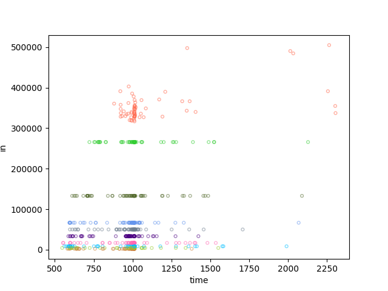

# TLS Privacy vs. Payload Length

The project has two parts, the analyzer and the generator. The generator generates network traffic
by loading web pages and the analyzer captures the network traffic, labels datasets and trains the model. The analyzer is implemented in Python (3.8+) and
the generator in nodejs (16+), these are required in order to run. See documentation for each part
on how to install application dependencies.

<p align="center">
  
  
</p>

The goal of the project is to build machine learning models usable on TLS encrypted websites. The model
should be able to distinguish pages within a site to break privacy and infer information about the user. As an example,
a user browses a health information site and reads about rare disease X - the model should then be able
to classify the flow and match it to the webpage describing disease X. 

It is not a primary interest to distinguish websites from each other, because this is much easier, already leaks
in multiple ways and doesn't break privacy to the same degree. As a result of the analysis, certain key characteristics
that makes sites easy to analyze is identified.

<p align="center">
  
</p>

<p align="center">
  Early sample of dataset for one site with ten pages, plotting page load size to time.
</p>
  
### Limitations

This is the authors first project considering machine learning so information might be incorrect, the approach inefficient etc. The 
project is nevertheless published here. In order for the project to see some success, limitations are as follows,

* Analyzes a single ciphersuite per site.
* Evaluate a limited number of features.
* Use of limited/ineffective/simple learning algorithms.
* Latency/jitter is not considered, LAN analysis only.
* Flows are generated by a single client (generator).
* The model is only trained for a single browser/version, Chromium.

### Ethical & Legal considerations

* Ensure that user consent has been explicitly given when capturing live data.
* Prefer to mirror websites and serve them locally on LAN for training.
* Ensure proper delay between site loads when testing against online sites.
* Limit the number of requests that is performed for online sites.

## Traffic analyzer

Implements the following features

* collects network traffic based on a given filter.
* communicates with the generator to label traffic.
* saves/loads traffic datasets in json.
* generates dataset visualisations.
* trains the machine learning model. 
* performs classification of traffic as it is analyzed.
* forwards information about identified pages in realtime.

### Requirements
To install requirements run `pip install -r requirements.txt`

The analyzer uses `asyncio`, `pandas` and `scapy`.

```
$ ./analyze -h
usage: -c [-h] {list,sniff,plot,learn,monitor} ...

optional arguments:
  -h, --help            show this help message and exit

Traffic analyzer:
  Available commands

  {list,sniff,plot,learn,monitor}
    list                lists the available interfaces
    sniff               capture network data to create data sets.
    plot                create plots of the given data set.
    learn               train a new model using the given data set.
    monitor             monitor traffic using the given model.
```

run example,

```
./analyze sniff --ip 192.168.0.149 --ports 443 --dump dataset_1 eno1
```

output sample,

```javascript
2022-05-04 11:35:29,357 started capture on 'eno1'
2022-05-04 11:35:29,357 using filter 'ip and host 192.168.0.149 and port (443)'..
2022-05-04 11:35:29,359 listening on '127.0.0.1:9555' and publishing on '224.0.0.14:9555'.
2022-03-29 09:48:52,050 capture in progress [packets = 0]
2022-03-29 09:42:53,815 sniffer collecting by label 'https://192.168.0.114/login' ..
2022-03-29 09:42:53,999 capture in progress [packets = 167]
2022-03-29 09:42:54,512 capture in progress [packets = 192]
```

## Traffic generator
Implements the following features

* generates network traffic by loading webpages using puppeteer/chrome.
* notifies the analyzer which site is being loaded for labeling.
* create clones of websites for testing locally.
* includes a mDNS beacon for hostname simulation.
* support realtime monitoring through a live Chromium browser.

### Requirements
To install dependencies, run `npm install` in `./generator`.

```
$ ./generate -h
usage: index.js [-v] {forge,serve,sites,site,beacon,monitor} ...

Dataset generator and real-time monitoring of analyzer.

optional arguments:
  -v, --version

Available commands:
  {forge,serve,sites,site,beacon,monitor}
    forge               Create a static copy of a remote website for the webserver
    serve               Serve static websites that the generator can target
    sites               list available sites.
    site                Generate web traffic for the analyzers sniffer module
    beacon              Multicast DNS beacon for hostname simulation
    monitor             monitor replay, requires a running analyzer.
```

run example,

```
./generate site testsite -d 0 -n 128 -c
```

output sample,

```javascript
2022-05-04 11:37:47 [INFO   ] generating data for 1 site(s).
2022-05-04 11:37:47 [INFO   ] starting generator with 128 load(s) per page and delay 0s.
2022-05-04 11:37:47 [INFO   ] notifier listening on '0.0.0.0:53330'.
2022-05-04 11:37:47 [INFO   ] cache is enabled.
[###########################] initializing generator.. [100%]
[########                   ] requests 24%, [360/1500] testsite (/256k)
```
## Tutorial
Step-by-step tutorial to get started.

1. choose a target website and clone it. The `-f` flag specifies the number of links to follow. It's also possible to run the forge command
multiple times with different urls for the same site to manually specify urls to clone. The `--missing` flag attempts to generate a 404
page which is then used by the webserver. `--favicon` attempts to explicitly request the favicon.ico as this isn't done when running
chromium in headless, this results in one extra request though. 

```bash
./generator forge https://example.com/ -f 5 -o example.com --missing --favicon
```

2. create a self-signed certificate, from `generator/server/keys/` run the following. 

```bash
./mkcert
```

Certificate options can be configured in `generator/server/keys/request.ext`, for more information on using certificates
please see generator/browser/server/keys/certificates.md.

For the DNS names set in request.ext ensure the hostname matches with the target. This can be done through `/etc/hosts` or with the mDNS beacon in step 4.

4. start the local webserver.

```bash
./generator serve -t -h2 -c br -p 443 example.com
```

4. start the mDNS beacon for hostname verification. (alternatively edit /etc/hosts)

```bash
./generator beacon <server-ip> example
```

5. start the analyzer in sniff mode and dump to dataset 'example'.

```bash
./analyze list # list the available interfaces
./analyze sniff --ip <server-ip> --ports 443 --dump example <interface>
```

6. run the traffic generator to generate browser traffic and label it.

a) create the site template in `generator/browser/sites/example.js`, which lists the urls to navigate.

```javascript
import {Site} from '../site.js';

export default class ExampleSite extends Site {

    constructor(browser) {
        super(browser, 'https://example/');
    }

    static pages() {
        return [
            '/1k-file.html',
            '/2k-file.html',
            '/4k-file.html',
            '/8k-file.html',
            '/16k-file.html'
        ];
    }
}
```

b) check that the created template is listed,

```bash
./generator list
# $ [..., example]
```

c) reference the created template file when running the site command.

```javascript
./generator site -d 0 -n 128 -c example
```

This will generate traffic for all listed urls, each url will be loaded n times.
Before loading each page the analyzer will be notified, to label requests. When complete the analyzer
dumps the collected network traffic into a json dataset.

7. plot charts from the generated dataset.

```bash
./analyzer plot example
```

This will create plots in `data/plots/example`.

8. use the generated dataset for machine learning.

```bash
./analyzer learn example 
```

Use `./analyzer learn -h` to find more options, this will create a model in `data/models/example.bin`.

9. run the analyzer in monitor mode.
```bash
./analyze monitor --ip <server-ip> --ports 443 <interface> example
```

This will sniff traffic and attempt to classify it using the given model. Again, try `-h` for more options.

10. manually generate website traffic to be classified using the generation browser.
```bash
./generator browser
```

This starts the Chromium browser using the same environment as it was used to generate traffic.

If successful the following should appear in the log

```bash
2022-05-04 12:04:45,198 started capture on '<interface>'
2022-05-04 12:04:45,198 using filter 'ip and host <server-ip> and port (443)'..
2022-05-04 12:04:45,199 loaded model from 'data/models/example.bin'.
...
2022-05-04 12:04:49,630 analyzing x1 page loads..
time                n/a
in                 1878
out                  36
packets              27
label      monitor-mode
Name: 0, dtype: object
2022-05-04 12:04:49,638 match example/4k-file.html with accuracy 100.00% in 1.03ms.
...
```

11. Viewing the identified pages in a realtime browser mirror
 
```bash
./generate browser --live
```

Note that the traffic generated by the mirrored browser should not be captured by the analyzer, this will
result in an infinite loop. Use a proxy, filter or a local server.

For tuning please list available options using the `-h` flag or see the source code.
